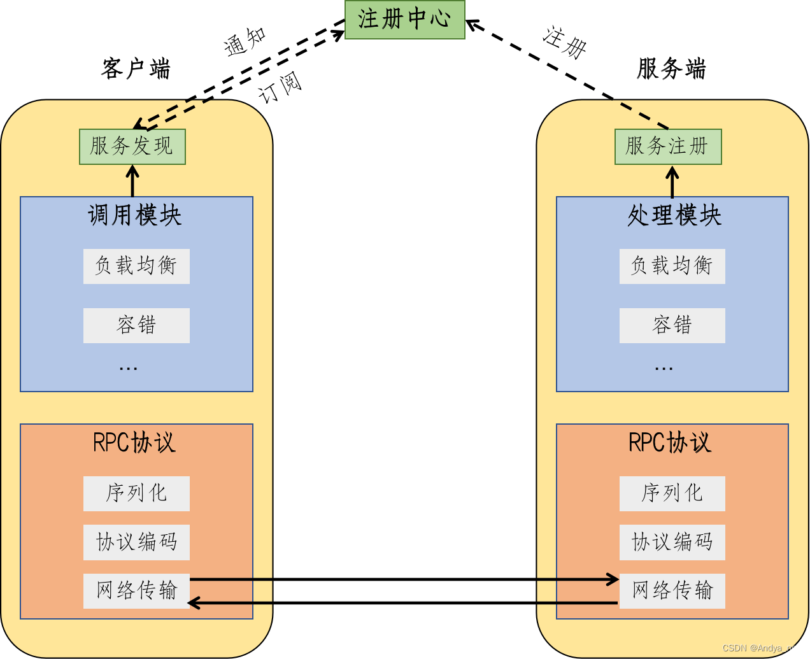

从第1版到第6版，逐步更新，优化框架的性能
会持续进行框架的升级...

# RPC概念

### 概念

1. RPC（Remote Procedure Call Protocol） 远程过程调用协议。
2. RPC是一种通过网络从远程计算机程序上请求服务，不需要了解底层网络技术的协议。
3. RPC主要作用就是不同的服务间方法调用就像本地调用一样便捷。

### 常用RPC技术或框架

应用级的服务框架：阿里的 Dubbo/Dubbox、Google gRPC、Spring Boot/Spring Cloud。
远程通信协议：RMI、Socket、SOAP(HTTP XML)、REST(HTTP JSON)。
通信框架：MINA 和 Netty

### 为什么要有RPC？

1. 服务化：微服务化，跨平台的服务之间远程调用；
2. 分布式系统架构：分布式服务跨机器进行远程调用；
3. 服务可重用：开发一个公共能力服务，供多个服务远程调用。
4. 系统间交互调用：两台服务器A、B，服务器A上的应用a需要调用服务器B上的应用b提供的方法，而应用a和应用b不在一个内存空间，不能直接调用，此时，需要通过网络传输来表达需要调用的语义及传输调用的数据。
   

#### 使用场景

1. `大型网站`：内部涉及多个子系统，服务、接口较多。
2. `注册发现机制`：如Nacos、Dubbo等，一般都有注册中心，服务有多个实例，调用方调用的哪个实例无感知。
3. `安全性`：不暴露资源。
4. `服务化治理`：微服务架构、分布式架构。

### 架构图

### 核心功能概念

核心功能实现主要分为**服务寻址**、**序列化和反序列化**、**网络传输功能**。

#### 服务寻址功能

**Call ID映射：**

​	本地：在本地方法调用中，函数体是直接通过函数指针来指定的，但是在远程调用中，由于两个进程的地址空间完全不一样，函数指针不起作用。
​	远程：RPC中所有函数或方法都有自己的一个ID，在所有进程中都唯一。客户端在做远程过程调用时，必须附上这个ID，即客户端会查一下表，找出相应的Call ID，然后传给服务端，服务端也会查表，来确定客户端需要调用的函数，然后执行相应函数的代码。
​	Call ID映射表一般是一个哈希表。

#### 序列化和反序列化功能

**概述：**

- 序列化：将消息对象转换为二进制流。

- 反序列化：将二进制流转换为消息对象。

**必要性**：
远程调用涉及到数据的传输，在本地调用中，只需要将数据压入栈中，然后让函数去栈中读取即可。
但远程的数据传输，由于客户端和服务端不在同一个服务器上，涉及不同的进程，不能通过内存传递参数，此时就需要将客户端先将请求参数转成字节流（编码），传递给服务端，服务端再将字节流转为自己可读取格式（解码），这就是序列化和反序列化的过程。反之，服务端返回值也逆向经历序列化和反序列化到客户端。

**序列化的优势：**
将消息对象转为二进制字节流，便于网络传输。
可跨平台、跨语言。如Python编写的客户端请求序列化参数传输到Java编写的服务端进行反序列化。

#### 网络传输功能

**作用**：

- 客户端将Call ID和序列化后的参数字节流传输给服务端。
- 服务端将序列化后的调用结果回传给客户端。

**协议**：
  主要有TCP、UDP、HTTP协议。

**基于TCP协议**

​	客户端和服务端建立Socket连接。
​	客户端通过Socket将需要调用的接口名称、方法名称及参数序列化后传递给服务端。
服务端反序列化后再利用反射调用对应的方法，将结果返回给客户端。

**基于HTTP协议**

​	客户端向服务端发送请求，如GET、POST、PUT、DELETE等请求。
​	服务端根据不同的请求参数和请求URL进行方法调用，返回JSON或者XML数据结果。

**TCP和HTTP对比**

- 基于TCP协议实现的RPC调用，由于是底层协议栈，更佳灵活的对协议字段进行定制，可减少网络开销，提高性能，实现更大的吞吐量和并发数。但**，底层复杂，实现代价高**。

- 基于HTTP协议实现的RPC调用，已封装实现序列化，但HTTP属于应用层协议，HTTP传输**所占用的字节数比TCP更高，传输效率对比TCP较低**。
  

# MyRPC01-

1.定义了通用消息对象 RpcRequest  RpcResponse
2.客户端使用动态代理，底层封装统一的RpcRequset消息，向客户端隐藏底层的消息传输

#### 存在的痛点

1. 服务端我们直接绑定的是UserService服务，如果还有其它服务接口暴露呢?（多个服务的注册）
2. 服务端以BIO的方式性能是否太低，
3. 服务端功能太复杂：监听，处理。需要松耦合

...

# MyRpc02-

建立本地服务暴露类，server将服务注册到serviceProvider中，rpcServer接收到消息，解析后在serviceProvider中寻找，调用

#### 此RPC最大的痛点

1. 传统的BIO与线程池网络传输性能低

如何在此基础上提升性能？

- 网络传输 从BIO -->NIO
- 序列化和反序列化方面提高效率
# MyRPC03-

1.重构客户端，抽象RpcClient接口
2.使用netty完成C-S之间的通信

#### 此RPC最大痛点

1. java自带序列化方式（Java序列化写入不仅是完整的类名，也包含整个类的定义，包含所有被引用的类），不够通用，不够高效

# MyRPC04-

1.自定义传输的消息格式，解决沾包问题
2.自定义编/解码器和序列化器

#### 此版本最大痛点

- 服务端与客户端通信的host与port预先就必须知道的，每一个客户端都必须知道对应服务的ip与端口号， 并且如果服务挂了或者换地址了，就很麻烦。扩展性也不强

# MyRPC05-

使用zookeeper作为注册中心
一个完整的RPC框架三个角色都有了：服务提供者，服务消费者，注册中心

- 根据服务名查询地址时，我们返回的总是第一个IP，导致这个提供者压力巨大，而其它提供者调用不到

使用负载均衡分配流量

客户端实现**负载均衡**多种策略：轮询，随机，LRU最近最少使用

# 后续框架优化的思考

**1.容错机制 如果服务调用失败，消费者应该如何处理呢**

为保证分布式系统的高可用，我们通常会给服务的调用增加一定的容错机制，如失败重试，降级调用其它接口等

**2.服务提供者下线了怎么办？**  
需要一个失效节点剔除机制

**3.消费者每次都要从注册中心中拉取信息，性能会不会很差？**
可以在客户端建立缓存来优化性能

**4.如何让整个框架更利于拓展？**
如使用Java的SPI机制，配置化等等
:::

